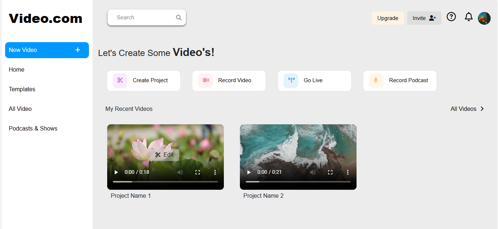

# Video Editor

Welcome to the Web-Based Video Editor project! This project aims to provide a cloud-based video editing solution that can be accessed via mainstream web browsers such as Chrome, Firefox, Opera, Edge, and Safari.

## Description

This web application allows users to edit videos directly within their web browser. It supports various editing features including Trim, Split, Add Music/Text, Crop, Resize, and Merge clips. Users can work with multiple tracks for both audio and video.

## Features

- Video edit tools such as Trim, Split, Add Music/Text, Crop, Resize, and Merge clips
- Support for multiple tracks for Audio/Video

## Screens

For the purpose of this assessment, we have implemented the UI for the following screens:

1. Dashboard
2. Video Editor

## Usage

To use the application, simply open the provided URL in your preferred web browser and navigate through the Dashboard and Video Editor screens to perform video editing tasks.

## Technologies Used

- HTML
- CSS
- JavaScript

## Screenshots

## How to Contribute

If you'd like to contribute to this project, feel free to fork the repository and submit a pull request with your changes. We welcome contributions of all kinds, whether it's bug fixes, feature enhancements, or documentation improvements.
